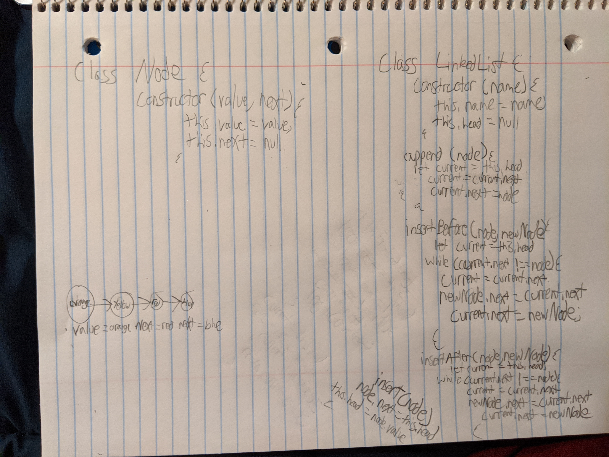

## Table of Contents

   # Reverse an Array
Write a function that takes in an array and reverses it withouth using the reverse method.

## Challenge
We are not allowed to use the array method that reverses arrays for us.

## Approach & Efficiency
-I need to take in an array.
-Create a new array with the spread operation.
-For loop through the original array and give take change the index by -1, esentially reversing the order.
-Return the mutated array that is now reversed.

## Solution
Created an new array with the the spread operation of the old array. Then looped through the array giving each item a negative index to reverse the order.

# Linked List
Write the following methods for the Linked List class:

.append(value) which adds a new node with the given value to the end of the list
.insertBefore(value, newVal) which add a new node with the given newValue immediately before the first value node
.insertAfter(value, newVal) which add a new node with the given newValue immediately after the first value node

## Challenge
Linked List is a new concept.

## Approach & Efficiency
-Create a node class
-Create a LinkedList class
Create append method that takes in a node and appends to the linked list.
Create an insertBefore method that takes a node and newNode, and inserts the newNode before the node.
Create an insertAfter method that takes a node and a newNode. and inserts the newNode after the node.

## Solution
Created a node class and then a linked list class. I created the append method taking in a node and then appending that to the head of the linked list. I then create a method that inserts a newNode into a linked list before the the given node. And then the same for the insertAfter function.

